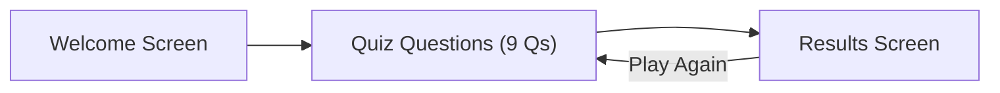

# Macronutrient Quiz Prototype

## Tech Stack

- **Single HTML file** (`index.html`) with embedded CSS and JS — no build tools, no frameworks, no dependencies. Opens directly in any browser.
- This keeps the prototype simple and easy to share/deploy later.

## Application Flow



### 1. Welcome Screen

- Title: "Macro Munch! The Food Group Challenge"
- Brief 2-sentence intro explaining macronutrients (proteins, carbs, fats) in kid-friendly language
- A "Start Quiz" button
- Bright, friendly color palette (soft greens, oranges, blues — no harsh neons)

### 2. Quiz Screen

- One question at a time, with a progress bar ("Question 3 of 9")
- Each question shows a prompt and a grid of emoji food icons as clickable cards
- Two question types (mixed throughout):
  - **Pick One:** "Which of these foods is packed with protein?" — 4 food icon options, select 1
  - **Select All:** "Tap all the foods that are carbohydrates!" — 6 food icon options, select multiple, confirm with a "Lock In!" button
- After answering, immediate feedback:
  - **Correct:** brief encouraging message + a one-line fun fact (e.g., "Protein helps your muscles grow and repair!")
  - **Incorrect:** gentle correction showing the right answer + the same fun fact
- "Next" button to advance

### 3. Results Screen

- Score displayed (e.g., "You got 7 out of 9!")
- A star/badge tier system: 9/9 = "Macro Master", 7-8 = "Nutrition Ninja", 5-6 = "Food Explorer", below 5 = "Keep Learning!"
- A short recap of the three macros with their key foods
- "Play Again" button that shuffles question order

## Question Content (9 Questions)

### Pick-One Questions (5 questions)

| #   | Prompt                                                    | Options (emoji + label)             | Correct     | Fun Fact                                                                                 |
| --- | --------------------------------------------------------- | ----------------------------------- | ----------- | ---------------------------------------------------------------------------------------- |
| 1   | "Which of these is a great source of protein?"            | Chicken leg, Bread, Apple, Butter   | Chicken leg | "Protein helps build and repair your muscles — like construction workers for your body!" |
| 2   | "Which food gives you the most carbohydrates for energy?" | Rice, Egg, Avocado, Fish            | Rice        | "Carbs are your body's favorite fuel — like gasoline for a car!"                         |
| 3   | "Which of these foods is high in healthy fats?"           | Avocado, Potato, Pasta, Chicken leg | Avocado     | "Healthy fats help your brain work better — your brain is actually about 60% fat!"       |
| 4   | "Which snack is a source of protein?"                     | Peanuts, Banana, Bread, Corn        | Peanuts     | "Nuts have protein AND healthy fats — a two-in-one power snack!"                         |
| 5   | "Which food is a carbohydrate that grows underground?"    | Potato, Cheese, Steak, Olive        | Potato      | "Potatoes are packed with energy and vitamins — they fueled entire civilizations!"       |

### Select-All Questions (4 questions)

| #   | Prompt                                           | Options (6 each)                             | Correct Answers                 | Fun Fact                                                                                         |
| --- | ------------------------------------------------ | -------------------------------------------- | ------------------------------- | ------------------------------------------------------------------------------------------------ |
| 6   | "Select ALL the foods that are rich in protein!" | Egg, Fish, Bread, Beans, Banana, Butter      | Egg, Fish, Beans                | "Protein isn't just in meat — beans and eggs are protein superstars too!"                        |
| 7   | "Select ALL the carbohydrate foods!"             | Pasta, Corn, Cheese, Banana, Steak, Bread    | Pasta, Corn, Banana, Bread      | "Fruits like bananas are carbs too — natural sugars are a type of carbohydrate!"                 |
| 8   | "Select ALL the foods with healthy fats!"        | Avocado, Olive, Rice, Cheese, Apple, Peanuts | Avocado, Olive, Cheese, Peanuts | "Your body NEEDS specific fats to absorb vitamins A, D, E, and K!"                               |
| 9   | "Select ALL the foods that are mainly protein!"  | Chicken leg, Steak, Potato, Fish, Pasta, Egg | Chicken leg, Steak, Fish, Egg   | "Your body uses protein to make enzymes and hormones — it does way more than just build muscle!" |

## Emoji-to-Food Mapping

Each food card is an emoji at large size (~64px) with a text label underneath:

- Chicken leg: 🍗 + "Chicken"
- Bread: 🍞 + "Bread"
- Rice: 🍚 + "Rice"
- Egg: 🥚 + "Egg"
- Fish: 🐟 + "Fish"
- Avocado: 🥑 + "Avocado"
- Pasta: 🍝 + "Pasta"
- Potato: 🥔 + "Potato"
- Banana: 🍌 + "Banana"
- Corn: 🌽 + "Corn"
- Cheese: 🧀 + "Cheese"
- Steak: 🥩 + "Steak"
- Peanuts: 🥜 + "Peanuts"
- Butter: 🧈 + "Butter"
- Olive: 🫒 + "Olive"
- Apple: 🍎 + "Apple"
- Beans: 🫘 + "Beans"

## UI / UX Design Details

- **Font:** System sans-serif stack, large readable sizes (18-24px body text)
- **Layout:** Centered card-based layout, max-width 700px, mobile-friendly
- **Food cards:** Rounded rectangles with a subtle shadow; on hover/tap they lift slightly; when selected they get a colored border (green for pick-one, blue highlight for select-all)
- **Color palette:** Warm and inviting — soft green (#4CAF50) for correct, gentle red/orange (#FF7043) for incorrect, light background (#FFF8E1)
- **Animations:** Gentle fade-in for questions, a small bounce on correct answers, subtle shake on incorrect
- **Accessibility:** All emoji cards have aria-labels, keyboard navigation support, focus outlines visible

## Scoring Logic

- **Pick-One questions:** 1 point for correct, 0 for incorrect
- **Select-All questions:** 1 point only if ALL correct options are selected and NO incorrect ones — partial credit is not awarded (keeps it simple and clear for kids)
- Total: 9 possible points

## File Structure

```
index.html        (single file — all HTML, CSS, and JS)
README.md         (brief description of the project and how to open it)
PLAN.md           (this plan file)
```
